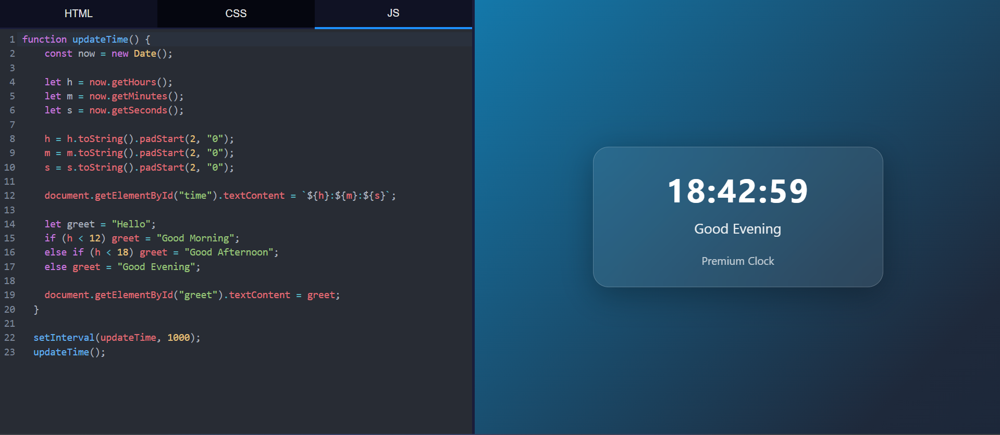

# HTML Sandbox

This is a very simple web sandbox. You can use it to write HTML, CSS, and Javascript code and see the results instantly.

It is great for testing small ideas or learning how to code for the web.

**[Try it here](https://playground.adyanth.in/)**

## Features

- **3 Editors**: It has 3 tabs. One for HTML, one for CSS, and one for JavaScript.  
- **Live Preview**: Your changes show up on the right side as soon as you type.  
- **Auto Save**: It automatically saves the code in localstorage so you dont lose progress when you reload.  
- **Resizable Panes**: You can drag the middle bar to make the editor or the preview bigger.  
- **Resetable Panes**: If you double click the bar between the editors and the preview, it will reset the panes to their default size.

## How to run it
1. `git clone https://github.com/adyanthm/html-playground.git`
2. Make sure you have [Node.js](https://nodejs.org/) installed.  
3. Open your terminal in this folder.
4. Run `npm install` to get the tools needed.
5. Run `npm run dev` to start the app.
6. Open the link shown in your terminal (usually `http://localhost:5173`).  

## Frameworks used

- **Vite**: So that its easy to access the modular [CodeMirror](https://codemirror.net/docs/) library.
- **CodeMirror**: For syntax highlighting and a neat, modern look.
